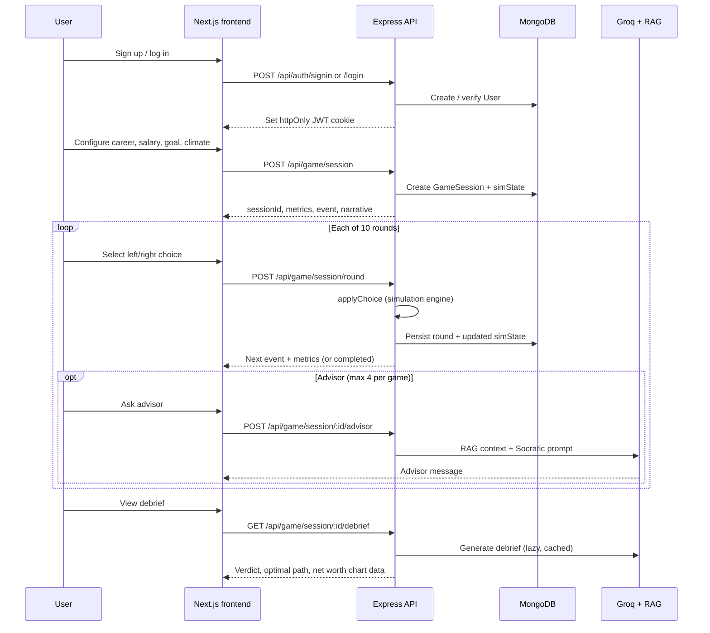

# FinSim — Live 10 Years in 15 Minutes

> A personal finance life simulator that puts players through 10 years of real financial decisions—rent, credit cards, layoffs, investments—and shows exactly where each choice leads.

FinSim is a **pnpm monorepo** with a Next.js frontend and an Express API. The **simulation engine runs on the server**; the client renders API responses and sends player choices. Sessions, auth, AI advisor, and debrief all persist through the backend.

| Package        | Path        | Name          | Role                          |
| -------------- | ----------- | ------------- | ----------------------------- |
| Frontend       | `frontend/` | `@finsim/web` | Next.js 16 App Router UI      |
| Backend        | `backend/`  | `@finsim/api` | Express API + simulation + AI |

**Deep dives:** [frontend/README.md](./frontend/README.md) · [backend/README.md](./backend/README.md)

---

## The Problem

Most teens enter adulthood without understanding credit scores, compound interest, debt, or how a single financial decision can snowball over decades. By the time the consequences show up, it is often too late to replay the moment.

**FinSim** makes those moments replayable before they are real.

---

## What It Is

A **10-round financial life simulation** where each round presents a procedurally generated event (credit offer, medical bill, layoff, investment opportunity, crisis, etc.).

Players choose a path by swiping or clicking. The server updates cash, debt, credit score, stress, and net worth. An **AI Socratic advisor** (Groq + RAG) can be invoked on demand during a run. After 10 rounds, a **debrief** compares the player's path to an optimal trajectory.

---

## Architecture (high level)

```text
┌─────────────────────────────────────────────────────────────────┐
│  Browser — Next.js (@finsim/web)                                │
│  AuthContext · GameContext · pages · game UI                    │
└────────────────────────────┬────────────────────────────────────┘
                             │ HTTPS + cookies (JWT)
                             ▼
┌─────────────────────────────────────────────────────────────────┐
│  Express API (@finsim/api) — port 8081                          │
│  /api/auth  /api/setup  /api/game  /api/ai                       │
└──────┬──────────────────┬──────────────────┬──────────────────────┘
       │                  │                  │
       ▼                  ▼                  ▼
  MongoDB            Groq LLM           Supabase pgvector
  (sessions,         (advisor,           (RAG knowledge
   users, setup)      debrief)            base)
```

**Key design choice:** the frontend does **not** compute round outcomes. All simulation logic lives in `backend/src/services/simulation/`. See [docs/MIGRATION-SERVER-AUTHORITATIVE-SIM.md](./docs/MIGRATION-SERVER-AUTHORITATIVE-SIM.md) for the migration notes.

---

## Data flow — one game session



---

## User journey

| Route           | Auth required | Purpose                                      |
| --------------- | ------------- | -------------------------------------------- |
| `/`             | No            | Landing page                                 |
| `/auth`         | No            | Sign up / log in                             |
| `/dashboard`    | Yes           | Past sessions, start new game                |
| `/setup`        | Yes           | Career, salary, goal, climate → new session  |
| `/game`         | Yes           | Main board — metrics, decisions, advisor     |
| `/debrief`      | Yes           | Post-game summary and net worth chart        |
| `/profile`      | Yes           | Account and onboarding profile               |
| `/leaderboard`  | No*           | Top scores (mock data + your run)            |
| `/onboarding`   | —             | Legacy/alternate onboarding UI               |

\*Leaderboard uses mock data in `frontend/lib/api.js` until a live endpoint is wired.

Typical happy path: **`/` → `/auth` → `/dashboard` → `/setup` → `/game` → `/debrief`**

---

## Repository layout

```text
finsim/
├── frontend/                 # @finsim/web — Next.js app
│   ├── app/                  # App Router pages + AuthContext
│   ├── components/           # UI, game board, layout, brand
│   ├── context/              # GameContext (client game view state)
│   ├── hooks/                # useGameSession, etc.
│   └── lib/                  # API helpers, formatters, types
│
├── backend/                  # @finsim/api — Express + MongoDB
│   ├── server.js             # Entry point, middleware, route mounting
│   ├── src/
│   │   ├── routes/           # auth, setup, game, ai
│   │   ├── controller/       # Request handlers
│   │   ├── Models/           # Mongoose schemas
│   │   ├── services/         # simulation, debrief, advisor
│   │   ├── ai/               # Groq prompts (advisor, debrief)
│   │   ├── rag/              # Knowledge base + pgvector retriever
│   │   └── middleware/       # JWT auth
│   └── scripts/              # Deploy + env validation
│
├── docs/                     # Architecture notes
├── .github/workflows/        # CI / backend deploy
├── ecosystem.config.cjs      # PM2 config for production API
├── package.json              # Workspace root scripts
└── pnpm-workspace.yaml
```

---

## Quick start

### Prerequisites

- **Node.js 20+**
- **pnpm** (recommended)
- **MongoDB** running locally or a remote `MONGO_URI`
- Optional for AI features: **Groq API key**, **Supabase** (pgvector for RAG)

### 1. Install

```bash
git clone https://github.com/your-username/finsim
cd finsim
pnpm install
```

### 2. Backend environment

```bash
cp backend/.env.example backend/.env
# Edit MONGO_URI, JWT_SECRET, PORT, GROQ_API_KEY, SUPABASE_* as needed
```

### 3. Frontend environment

Create `frontend/.env.local`:

```bash
NEXT_PUBLIC_API_URL=http://localhost:8081/api
```

### 4. Run both services

```bash
# Terminal 1 — API (default port 8081)
pnpm dev:backend

# Terminal 2 — web app (port 3000)
pnpm dev
```

Open [http://localhost:3000](http://localhost:3000). Health check: `GET http://localhost:8081/api/health`.

### Workspace scripts

| Command            | Description                         |
| ------------------ | ----------------------------------- |
| `pnpm dev`         | Start Next.js frontend              |
| `pnpm dev:backend` | Start Express API with `--watch`    |
| `pnpm build`       | Production build of the frontend    |
| `pnpm start`       | Run production frontend server      |
| `pnpm lint`        | ESLint on the frontend              |

Run a package directly:

```bash
pnpm --filter @finsim/web dev
pnpm --filter @finsim/api dev
```

---

## Stack

| Layer        | Technology                                              |
| ------------ | ------------------------------------------------------- |
| Frontend     | Next.js 16, React 19, Tailwind CSS v4, Framer Motion    |
| Backend      | Express 4, Mongoose, JWT cookies, rate limiting         |
| Database     | MongoDB (users, sessions, setup profiles)               |
| AI           | Groq SDK — Socratic advisor + post-game debrief         |
| RAG          | Supabase pgvector + local embeddings (`@xenova/transformers`) |
| Charts       | Recharts                                                |
| Monorepo     | pnpm workspaces                                         |

---

## Onboarding checklist for new developers

1. Read this file for the big picture and data flow.
2. Clone, install, configure env files, run `pnpm dev` + `pnpm dev:backend`.
3. Create an account at `/auth`, start a game from `/setup`, play through `/game`.
4. Read [frontend/README.md](./frontend/README.md) before touching UI or client state.
5. Read [backend/README.md](./backend/README.md) before changing simulation, routes, or AI.
6. Skim [docs/MIGRATION-SERVER-AUTHORITATIVE-SIM.md](./docs/MIGRATION-SERVER-AUTHORITATIVE-SIM.md) if you wonder why the client never computes metrics.

---

## Deployment

Backend deployment via GitHub Actions → VPS is documented in [backend/DEPLOY.md](./backend/DEPLOY.md).

---

## License

Add your preferred license here before publishing.
